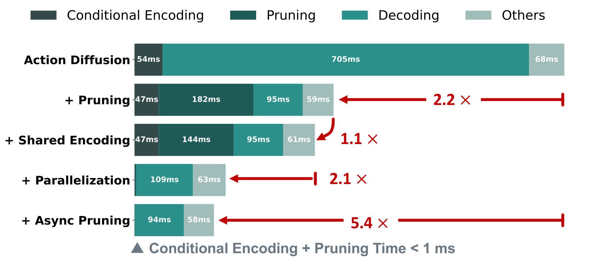
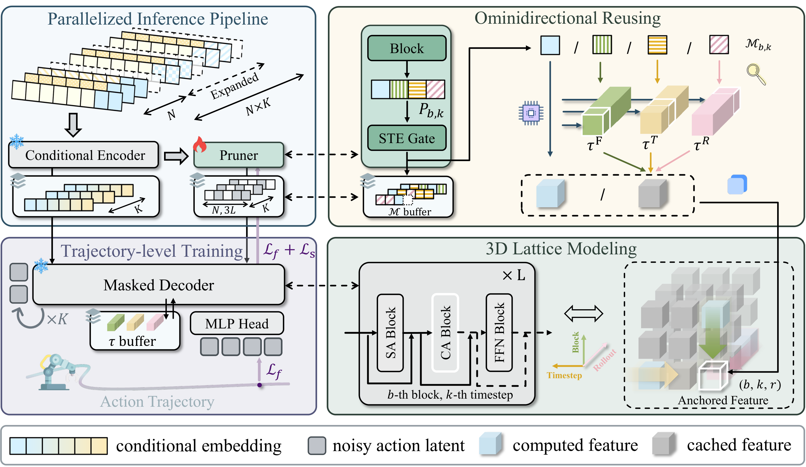

# Test-time Sparsity for Extreme Fast Action Diffusion

<div align="center">

### ⚡ Accelerate Action Diffusion by 5× via Dynamic Test-time Pruning and Omnidirectional Feature Reusing

[]()
[]()
[](https://github.com/ky-ji/Test-time-Sparsity)
[](https://opensource.org/licenses/MIT)
[](https://cvpr.thecvf.com/)

**CVPR 2026**

[Paper]() | [Code](https://github.com/ky-ji/Test-time-Sparsity)

<p align="center">
  
</p>

</div>

---

## Overview

**Test-time Sparsity (TTS)** accelerates action diffusion by dynamically predicting prunable residual computations for each model forward at test time. Our method reduces FLOPs by **92%** and achieves **5× wall-clock speedup**, reaching an inference frequency of **47.5 Hz** on an NVIDIA 4090 GPU without performance degradation.

- **Dynamic Test-time Pruning**: A lightweight pruner that shares the encoder with the diffusion transformer, dynamically predicting skippable residual computations before each forward pass
- **Omnidirectional Feature Reusing**: Achieves **95% sparsity** by selectively reusing features cached from the current forward, previous denoising timesteps, and earlier rollout iterations
- **Highly Parallelized Pipeline**: Decouples encoding and pruning from the autoregressive denoising loop, reducing non-decoder delay to milliseconds via parallel processing and asynchronous execution

<p align="center">
  
</p>

---

## Installation

```bash
git clone https://github.com/ky-ji/Test-time-Sparsity.git
cd Test-time-Sparsity

git submodule update --init --recursive

conda env create -f conda_environment.yaml
conda activate robodiff

pip install -e .
```

---

## Simulation Reproduction

This section reproduces the main results from Tables 1–3 of the paper using the `TTSInfer` module.

### Step 1: Download Diffusion Policy datasets

Follow the [Diffusion Policy data download instructions](https://diffusion-policy.cs.columbia.edu/) to download the robosuite / FurnitureBench datasets. By default the code expects data under a `data/` directory.

Supported tasks: `can_ph`, `can_mh`, `lift_ph`, `lift_mh`, `square_ph`, `square_mh`, `transport`, `tool_hang`, `kitchen`.

### Step 2: Train or download the baseline Diffusion Policy checkpoint

```bash
cd diffusion_policy
python train.py --config-name=train_diffusion_transformer_hybrid_workspace \
  task=<task_name>
```

Or download pre-trained checkpoints from the [Diffusion Policy project page](https://diffusion-policy.cs.columbia.edu/).

### Step 3: Export trajectory data

Run the trained baseline policy and collect successful rollout trajectories:

```bash
python -m TTSInfer.scripts.collect_trajectory_data \
  --checkpoint /path/to/diffusion_policy.ckpt \
  --output_dir pruner_tra_data_max/trajectories/<task_name> \
  --num_episodes 100 \
  --device cuda:0
```

Only successful episodes are saved. Repeat for each task. Expected output structure:

```
pruner_tra_data_max/trajectories/<task_name>/
├── dataset_summary.json
└── episodes/
    ├── episode_000000/
    │   ├── metadata.json
    │   ├── trajectory.pt
    │   └── videos/
    └── ...
```

### Step 4: Train the Pruner

```bash
python -m TTSInfer.scripts.train_eval.train_pruner \
  --task_name can_ph \
  --device cuda:0 \
  --output_dir sim_result \
  --config TTSInfer/pruner_config/training_config.yaml \
  --datatype max \
  --train_version 0
```

**Output**: `sim_result/pruner_ckpt/<timestamp>/<train_id>/<task_name>/pruner_model_<epoch>_<loss>.pt`

### Step 5: Evaluate

```bash
python -m TTSInfer.scripts.train_eval.eval_pruner \
  --output_dir sim_result/pruner_ckpt \
  --timestamp <train_timestamp> \
  --task_name can_ph \
  --train_id 0 \
  --epoch <best_epoch> \
  --device cuda:0
```

### Step 6: Speed Benchmarking

```bash
python -m TTSInfer.scripts.exp.eval_speed_only \
  -t can_ph \
  -e <epoch> \
  --timestamp <train_timestamp> \
  --train_root <path_to_sim_result/pruner_ckpt/<timestamp>/<train_id>/<task_name>> \
  --device cuda:0
```

---

## Real-World Robot Pipeline

The `realworld-TTS/` module provides a complete pipeline for deploying TTS on real robots.

### Step 1: Convert collected data to trajectory format

```bash
cd realworld-TTS

ZARR_DATASET=/path/to/your_dataset.zarr \
TRAJECTORY_DIR=/path/to/output_trajectory \
CHECKPOINT=/path/to/dp_policy.ckpt \
bash train/convert_data.sh
```

Copy and adapt a training config for your task:

```bash
cp train/configs/train_pruner_config_pick.yaml train/configs/my_task.yaml
```

### Step 2: Train the pruner on real robot data

```bash
cd realworld-TTS

CONFIG=train/configs/my_task.yaml \
CHECKPOINT=/path/to/dp_policy.ckpt \
TRAJECTORY_DIR=/path/to/output_trajectory \
OUTPUT_DIR=./output/pruner_tts \
bash train/train_pruner.sh
```

Multi-GPU training is supported automatically when `NUM_GPUS > 1`.

### Step 3: Run TTS-Accelerated Inference Server

```bash
cd realworld-TTS

python tts_accelerator/scripts/run_dp_with_tts.py \
  --config tts_accelerator/configs/assembly_bun.yaml
```

Edit `realworld-TTS/server/configs/server_config_local.py` to set checkpoint paths, device, scheduler type, and pruning ratio.

---

## License

This project is licensed under the MIT License - see the [LICENSE](LICENSE) file for details.

</div>
